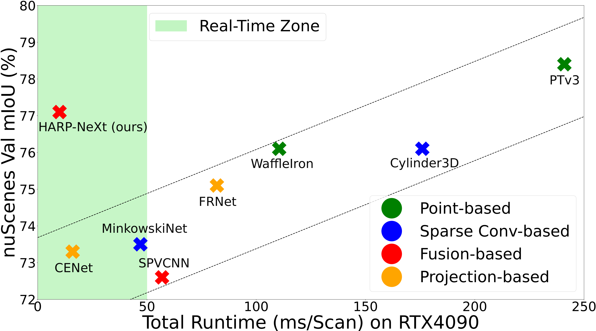
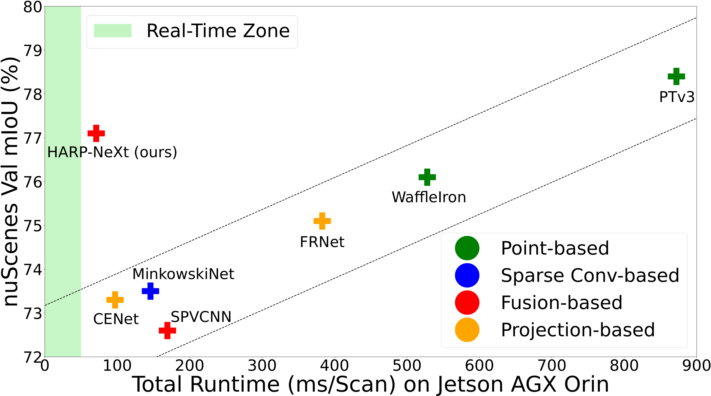

<div align="center">
    <h2><strong>HARP-NeXt: High-Speed and Accurate Range-Point Fusion Network for 3D LiDAR Semantic Segmentation</strong></h2>
</div>

<div align="center">
    <a href="https://scholar.google.com/citations?user=aQu045IAAAAJ" target='_blank'>Samir Abou Haidar</a><sup>1,2</sup>,&nbsp;&nbsp;
    <a href="https://scholar.google.com/citations?user=z5TdCDcAAAAJ" target='_blank'>Alexandre Chariot</a><sup>1</sup>,&nbsp;&nbsp;
    <a href="https://scholar.google.com/citations?user=Uz-mAl0AAAAJ" target='_blank'>Mehdi Darouich</a><sup>1</sup>,&nbsp;&nbsp;
    <a href="https://scholar.google.com/citations?user=p0R5vbsAAAAJ" target='_blank'>Cyril Joly</a><sup>2</sup>,&nbsp;&nbsp;
    <a href="https://scholar.google.com/citations?user=zR1n_4QAAAAJ" target='_blank'>Jean-Emmanuel Deschaud</a><sup>2</sup>
    </br>
    <sup>1</sup>Paris-Saclay University, CEA List&nbsp;&nbsp;&nbsp;
    <sup>2</sup>Mines Paris PSL University, Centre for Robotics (CAOR)&nbsp;&nbsp;&nbsp;
    </br>
</div>

</br>

<div align="center">
    <a href="https://arxiv.org/abs/2510.06876" target="_blank">
        
    </a>
    <a href="https://youtu.be/RmLJ7W5WjqQ" target="_blank">
        
    </a>
    <a href="https://cloud.minesparis.psl.eu/index.php/s/eUOcaEXZRLNfV1e/download?path=%2Fvideo&files=HARP-NeXt%20nuScenes%20vid.mp4" target='_blank'>
        
    </a>
</div>

## About

This is the official repo of **HARP-NeXt**, a High-Speed and Accurate Range-Point Fusion Network for 3D LiDAR Semantic Segmentation. We first propose
a novel pre-processing methodology that significantly reduces computational overhead. Then, we design the **Conv-SE-NeXt** feature extraction block to efficiently capture representations without deep layer stacking per network stage. We also employ a multi-scale range-point fusion backbone that leverages information
at multiple abstraction levels to preserve essential geometric details, thereby enhancing accuracy.


<p align="center">
  <br>
  <em>Fast and Accurate 3D Scene Semantic Segmentation on nuScenes</em>
</p> 


## Updates

- \[2025.10\] - We provide trained network weights on nuScenes and SemanticKITTI benchmarks. The checkpoints are available [here](https://cloud.minesparis.psl.eu/index.php/s/eUOcaEXZRLNfV1e).
- \[2025.10\] - Our paper is available on [arXiv](https://arxiv.org/abs/2510.06876), and the code is publicly available.
- \[2025.06\] - Our paper was accepted by [IROS 2025](https://www.iros25.org/).

## Results
HARP-NeXt achieves high accuracy in real-time on the RTX 4090 GPU at 100 FPS, while delivering near real-time performance on the Jetson AGX Orin embedded system, breaking performance trends.

|  |  |
| :---------------------------------------------------------: | :-----------------------------------------------------------: |
| mIoU *vs.* Runtime on the NVIDIA RTX 4090 GPU | mIoU *vs.* Runtime on the NVIDIA Jetson AGX Orin |

### Performance Comparison with State-of-the-Art Methods
<table>
    <tr>
        <th rowspan="2">Method</th>
        <th rowspan="2">Params</th>
        <th colspan="3">nuScenes</th>
        <th colspan="3">SemanticKITTI</th>
    </tr>
    <tr>
        <td>mIoU (Val)</td>
        <td>FPS (RTX 4090)</td>
        <td>FPS (AGX Orin)</td>
        <td>mIoU (Val)</td>
        <td>FPS (RTX 4090)</td>
        <td>FPS (AGX Orin)</td>
    </tr>
    <tr>
        <td>WaffleIron</td>
        <td>6.8 M</td>
        <td>76.1</td>
        <td>9.0</td>
        <td>1.9</td>
        <td>65.8</td>
        <td>2.7</td>
        <td>0.5</td>
    </tr>
    <tr>
        <td>PTv3</td>
        <td>15.3 M</td>
        <td>78.4</td>
        <td>4.1</td>
        <td>1.1</td>
        <td>-</td>
        <td>-</td>
        <td>-</td>
    </tr>
    <tr>
        <td>SalsaNext</td>
        <td>6.7 M</td>
        <td>68.2</td>
        <td>76.9</td>
        <td>19.6</td>
        <td>55.9</td>
        <td>27.7</td>
        <td>9.1</td>
    </tr>
    <tr>
        <td>CENet</td>
        <td>6.8 M</td>
        <td>73.3</td>
        <td>62.5</td>
        <td>10.3</td>
        <td>62.6</td>
        <td>17.2</td>
        <td>6.0</td>
    </tr>
    <tr>
        <td>FRNet</td>
        <td>10.0 M</td>
        <td>75.1</td>
        <td>12.2</td>
        <td>2.6</td>
        <td>66.0</td>
        <td>11.6</td>
        <td>2.5</td>
    </tr>
    <tr>
        <td>MinkowskiNet</td>
        <td>21.7 M</td>
        <td>73.5</td>
        <td>21.2</td>
        <td>6.8</td>
        <td>64.3</td>
        <td>14.1</td>
        <td>4.7</td>
    </tr>
    <tr>
        <td>Cylinder3D</td>
        <td>55.9 M</td>
        <td>76.1</td>
        <td>5.6</td>
        <td>-</td>
        <td>63.2</td>
        <td>3.2</td>
        <td>-</td>
    </tr>
    <tr>
        <td>SPVCNN</td>
        <td>21.8 M</td>
        <td>72.6</td>
        <td>17.5</td>
        <td>5.9</td>
        <td>65.3</td>
        <td>11.7</td>
        <td>3.9</td>
    </tr>
    <tr>
        <td><strong>HARP-NeXt</strong></td>
        <td>5.4 M</td>
        <td>77.1</td>
        <td>100</td>
        <td>14.1</td>
        <td>65.1</td>
        <td>76.9</td>
        <td>8.3</td>
    </tr>
</table>


## Installation

### A. Desktop / Workstation (conda) 
We recommend using [conda](https://docs.conda.io/en/latest/) with the `conda-forge` channel.

#### 1. Create and activate the environment
We recommend Python 3.10–3.12 (tested with 3.12)
```bash
conda create -n harpnext -c conda-forge python=3.12
conda activate harpnext
```

#### 2. Install PyTorch
We use PyTorch v2.5.0 with CUDA 11.8:
```bash
pip install torch==2.5.0 torchvision==0.20.0 torchaudio==2.5.0 --index-url https://download.pytorch.org/whl/cu118
```

#### 3. Additionally install essentials
```bash
conda install -c conda-forge numpy tqdm tensorboard
pip install torch-scatter -f https://data.pyg.org/whl/torch-2.5.0+cu118.html
pip install pyyaml seaborn opencv-python
```

### B. Jetson Platforms (venv)
We recommend using [venv](https://docs.python.org/3/library/venv.html) virtual environment and installing PyTorch (for JetPack) following NVIDIA's [documentation](https://docs.nvidia.com/deeplearning/frameworks/install-pytorch-jetson-platform/index.html). The following installation is tested on an NVIDIA Jetson AGX Orin Developer Kit with a JetPack 6.0 (L4T R36.2 / R36.3).

#### 1. Create and activate the environment
We recommend creating a Python 3 venv:
```bash
python3 -m venv harpnext
source harpnext/bin/activate
```
#### 2. Install PyTorch
We use PyTorch v2.3.0 with CUDA 12.4:
```bash
wget https://nvidia.box.com/shared/static/zvultzsmd4iuheykxy17s4l2n91ylpl8.whl -O torch-2.3.0-cp310-cp310-linux_aarch64.whl
sudo apt-get install python3-pip libopenblas-base libopenmpi-dev libomp-dev
pip3 install 'Cython<3'
pip3 install numpy torch-2.3.0-cp310-cp310-linux_aarch64.whl
```

#### 3. Additionally install essentials
```bash
pip3 install tqdm tensorboard
pip3 install torch-scatter
pip3 install pyyaml seaborn opencv-python
```

## Data Preparation

### nuScenes:
You can download the nuScenes dataset from the [official website](https://www.nuscenes.org/download) with the following structure:
```
nuscenes
├── lidarseg
|   ├── v1.0-mini
|   ├── v1.0-test
|   ├── v1.0-trainval
├── panoptic
├── samples
├── v1.0-mini
├── v1.0-test
├── v1.0-trainval
```

### SemanticKITTI:
You can download the SemanticKITTI dataset from the [official website](http://www.semantic-kitti.org/dataset.html) with the following structure:
```
semantickitti
├── sequences
│   ├── 00
│   │   ├── labels
│   │   ├── velodyne
│   ├── 01
│   ├── ..
│   ├── 21
```


## Pretrained Models
You can download the pretrained weights on nuScenes and SemanticKITTI from [here](https://cloud.minesparis.psl.eu/index.php/s/eUOcaEXZRLNfV1e) and save them in the `./pretrained/` directory.


## Testing Pretrained Models

You can evaluate HARP-NeXt's pretrained model on nuScenes as follows:
```
python main.py \
--net harpnext \
--dataset nuscenes \
--path_dataset /path/to/nuscenes \
--mainconfig ./configs/main/main-config.yaml \
--netconfig ./configs/net/harpnext-nuscenes.yaml \
--log_path ./pretrained/harpnext-nuscenes-32x480 \
--gpu 0 \
--seed 0 \
--fp16 \
--restart \
--eval
```

You can evaluate HARP-NeXt's pretrained model on SemanticKITTI as follows:
```
python main.py \
--net harpnext \
--dataset semantic_kitti \
--path_dataset /path/to/SemanticKITTI \
--mainconfig ./configs/main/main-config.yaml \
--netconfig ./configs/net/harpnext-semantickitti.yaml \
--log_path ./pretrained/harpnext-cutmix-semantickitti-64x512 \
--gpu 0 \
--fp16 \
--restart \
--eval
```

You can choose whether to execute the pre-processing on **CPU** or **GPU** by setting the option in the corresponding netconfig `harpnext-nuscenes.yaml` and `harpnext-semantickitti.yaml` files.


## Training 

### nuScenes

You can retrain the harpnext-nuscenes-32x480 model on nuScenes as follows:
```
python main.py \
--net harpnext \
--dataset nuscenes \
--path_dataset /path/to/nuscenes \
--mainconfig ./configs/main/main-config.yaml \
--netconfig ./configs/net/harpnext-nuscenes.yaml \
--log_path ./logs/harpnext-nuscenes-32x480-retrain \
--gpu 0 \
--seed 0 \
--fp16
```

### SemanticKITTI
You can retrain the harpnext-cutmix-semantickitti-64x512 model on SemanticKITTI as follows: 
```
python main.py \
--net harpnext \
--dataset semantic_kitti \
--path_dataset /path/to/SemanticKITTI \
--mainconfig ./configs/main/main-config.yaml \
--netconfig ./configs/net/harpnext-semantickitti.yaml \
--log_path ./logs/harpnext-cutmix-semantickitti-64x512-retrain \
--gpu 0 \
--fp16
```

You can enable or disable the Instance CutMix and PolarMix augmentations, during the training only on SemanticKITTI, by setting the `instance_cutmix` flag in the `main-config.yaml` file (`True` to enable, `False` to disable). The extracted instances are saved in `/tmp/semantic_kitti_instances/`. Always set to `False` when evaluating the models. 


## License

This work is under the [Apache 2.0 license](LICENSE).

## Citation

Kindly consider citing our paper if you find this work helpful:

```
@article{abouhaidar2025harpnext,
  title={HARP-NeXt: High-Speed and Accurate Range-Point Fusion Network for 3D LiDAR Semantic Segmentation},
  author={Abou Haidar, Samir and Chariot, Alexandre and Darouich, Mehdi and Joly, Cyril and Deschaud, Jean-Emmanuel},
  journal={arXiv preprint arXiv:2510.06876},
  year={2025}
}
```

## Acknowledgements

We acknowledge and thank the following public resources used in this work: 

- [SemanticKITTI](http://www.semantic-kitti.org) (CC BY-NC-SA 4.0)
- [SemanticKITTI-API](https://github.com/PRBonn/semantic-kitti-api) (MIT)
- [nuScenes](https://www.nuscenes.org/nuscenes) (CC BY-NC-SA 4.0) 
- [nuScenes-devkit](https://github.com/nutonomy/nuscenes-devkit) (Apache 2.0)
- [SalsaNext](https://github.com/TiagoCortinhal/SalsaNext) (MIT)
- [CENet](https://github.com/huixiancheng/CENet) (MIT)
- [MinkowskiNet](https://arxiv.org/abs/1904.08755)
- [SPVNAS](https://github.com/mit-han-lab/spvnas) (MIT)
- [Cylinder3D](https://github.com/xinge008/Cylinder3D) (Apache 2.0)
- [FRNet](https://github.com/Xiangxu-0103/FRNet) (Apache 2.0)
- [WaffleIron](https://github.com/valeoai/WaffleIron) (Apache 2.0)
- [2DPASS](https://github.com/yanx27/2DPASS) (MIT)  
- [PTv3](https://github.com/Pointcept/PointTransformerV3) (MIT) 
- [PointNeXt](https://github.com/guochengqian/pointnext) (MIT)
- [RPVNet](https://arxiv.org/abs/2103.12978) 
- [Deep Residual Networks](https://github.com/KaimingHe/deep-residual-networks) (MIT) 
- [ConvNeXt](https://github.com/facebookresearch/ConvNeXt) (MIT) 
- [MobileNetv3](https://arxiv.org/abs/1905.02244)  
- [Squeeze-and-Excitation](https://arxiv.org/abs/1709.01507)  
- [LovaszSoftmax](https://github.com/bermanmaxim/LovaszSoftmax) (MIT)
- [Boundary Loss](https://arxiv.org/abs/1905.07852) (MIT)
- [PolarMix](https://github.com/xiaoaoran/polarmix) (MIT) 
- [LaserMix](https://github.com/ldkong1205/LaserMix) (Apache 2.0) 


